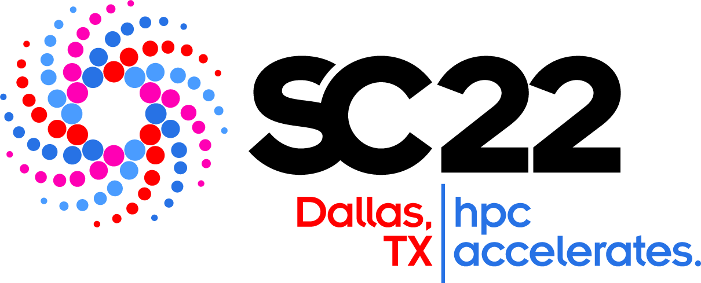

# MCHPC'22: Workshop on Memory Centric High Performance Computing

## Time/Date: 2:00PM - 5:30PM, U.S. Central Standard Time, Sunday, November 13, 2022
## Location: [Kay Bailey Hutchison Convention Center, Dallas](https://sc22.supercomputing.org/attend/convention-center/)
## [Submit here](https://submissions.supercomputing.org/?page=Submit&id=SC22WorkshopMCHPC22Submission&site=sc22)

<!-- ## [Virtual Event Info from SC'20](https://sc20.supercomputing.org/2020/07/27/sc20-virtual-event-announced-by-general-chair-christine-e-cuicchi/)
-->
----

### held in conjunction with SC22: [The International Conference on High Performance Computing, Networking, Storage and Analysis](https://sc22.supercomputing.org) and in cooperation with [IEEE Computer Society](https://www.computer.org)

 &nbsp;&nbsp;&nbsp;&nbsp;  

----
## [Introduction](#intro) &nbsp;&nbsp;&nbsp;&nbsp; [CFP](CallForPapers_MCHPC2022.pdf) &nbsp;&nbsp;&nbsp; [Organizers](#org) &nbsp;&nbsp;&nbsp;&nbsp; [Program Committee](#pc) &nbsp;&nbsp;&nbsp;&nbsp; [Submission](#submission) &nbsp;&nbsp;&nbsp;&nbsp; [Program](#program) &nbsp;&nbsp;&nbsp;&nbsp; [Previous Workshops](#previous)

---

## Introduction
The growing disparity between CPU speed and memory speed, known as the memory wall problem, has been one of the most critical and long-standing challenges in the computing industry. The situation is further complicated by the recent expansion of the memory hierarchy and the blurred boundary between memory and storage. The memory hierarchy is becoming deeper and more diversified with the adoption of new memory technologies and architectures, including 3D-stacked memory, non-volatile random-access memory (NVRAM), memristor, hybrid software and hardware caches, etc. Computer architecture and hardware systems, operating systems, storage and file systems, programming stack, performance models and tools are being enhanced, augmented, or even redesigned to address the performance, programmability, and energy efficiency challenges of the increasingly complex and heterogeneous memory systems for HPC and data-intensive applications.
The MCHPC workshop aims to bring together computer and computational science researchers, from industry, government labs and academia, concerned with the challenges of efficiently using existing and emerging memory systems. The term performance for memory systems is general, which includes latency, bandwidth, power consumption and reliability from the aspect of hardware memory technologies to what it is manifested in the application performance. The topics of interest for the MCHPC workshop include, but are not limited to:
 
* Software, hardware, and co-design approaches that ease the adoption and optimize the use of processing-in-memory and near-memory computing technologies.
* Evaluation, characterization, performance analysis, and use cases of emerging memory technologies, including non-volatile memories, high-bandwidth memory, heterogeneous memory, disaggregated memory, etc.
* Programming interfaces or language extensions that improve the programmability of using emerging memory technologies and systems, heterogeneous memory system and multi-dimensional data, and unified memory systems. 
* Compiler, runtime, and system techniques for optimizing data layout and placement, page migration, coherence and consistency enforcement, latency hiding and improving bandwidth utilization and energy consumption of heterogeneous memory systems. 
* Enhancement or new development for operating systems, storage and file systems, and I/O system that address challenges of existing and emerging memory technologies, heterogeneous memory systems, and the blurred boundary between memory and storage. 
* Tools, modeling, evaluation, and case study of memory system behavior and application performance that reveals the limitation and characteristics of existing memory systems.
* Application development and optimization for new memory architecture and technologies.

### Important Dates
 + Submission Deadline -- August 19, 2022
 + Notifications -- September 12, 2022
 + Camera Ready Papers -- October 9, 2022, including IEEE Copyright Form
 + November 13 2022 - Workshop

  <!-- September 25th 2016 (23:59 AoE) - Late Breaking and Short Paper Submissions
 [comment]: <> October 7th 2016 - Late Breaking and Short Paper Notifications
 -->
 
----

## Organizers
 + Ron Brightwell (Sandia National Laboratories, USA)
 + Maya B Gokhale (Lawrence Livermore National Laboratory, USA)
 + Ivy B Peng (KTH Royal Institute of Technology, Sweden)
 + Yonghong Yan (University of North Carolina at Charlotte, USA)
 

## Submission
Authors are invited to submit manuscripts in English structured as technical papers up to 8 pages or as short papers up to 5 pages, both of letter size (8.5in x 11in) and including figures, tables, and references. Submissions not conforming to these guidelines may be returned without review. 
<!--Your paper should be formatted using **sigconf** of the ACM Master Article Template from
[https://www.acm.org/publications/proceedings-template](https://www.acm.org/publications/proceedings-template).-->
Your paper should be formatted using **IEEE conference format** which can be found from [https://www.ieee.org/conferences/publishing/templates.html](https://www.ieee.org/conferences/publishing/templates.html). The workshop encourage submitters to include reproducibility information, using [Reproducibility Initiative for SC'22 Technical Papers](https://sc22.supercomputing.org/submit/reproducibility-initiative/) as guideline.

All manuscripts will be peer-reviewed and judged on correctness, originality, technical strength, and significance, quality of presentation, and interest and relevance to the workshop attendees. Submitted papers must represent original unpublished research that is not currently under review for any other conference or journal. Papers not following these guidelines will be rejected without review and further action may be taken, including (but not limited to) notifications sent to the heads of the institutions of the authors and sponsors of the conference. Submissions received after the due date, exceeding length limit, or not appropriately structured may also not be considered. At least one author of an accepted paper must register for and attend the workshop. Authors may contact the workshop organizers for more information. 

Papers should be submitted electronically at: [https://submissions.supercomputing.org/](https://submissions.supercomputing.org/), choose "SC22 Workshop: MCHPC'22: Workshop on Memory Centric High Performance Computing". 

The final papers are planned to be published through IEEE Computer Society. Published proceedings will be included in the IEEE Xplore digital library. 

<!-- We plan to invite selected papers for an extended version in a journal special issue. -->

<!--Full papers will be published with the SC'17 workshop proceedings in the ACM Digital Library and IEEE Xplore. Selected papers will be invited for an extended version in a special issue of the Journal of Computational Science (JoCS).

09:00-10:00 workshop
10:00-10:30 break (food provided by SC)
10:30-12:30 workshop
--> 
 
## Program Committee
 + Ron Brightwell (Sandia National Laboratories)
 + Ivy Peng (KTH Royal Institute of Technology)
 + Stephen L Olivier (Sandia National Laboratories)
 + Gwendolyn Voskuilen (Sandia National Laboratories)
 + Seyong Lee (Oak Ridge National Laboratory)
 + Yonghong Yan (University of North Carolina at Charlotte)
 + Tom Deakin (University of Bristol)
 + Kyle Hale (Illinois Institute of Technology)
 + Dong Li (University of California, Merced)
 + Chunhua Liao (Lawrence Livermore National Laboratory)
 + Alice Koniges (Univ. of Hawaii, Maui High Performance Computing Center)

<!--
 + Ron Brightwell (Sandia National Laboratories, rbbrigh@sandia.gov)
 + Yonghong Yan (University of North Carolina at Charlotte, yyan7@uncc.edu)
 + Xian-He Sun (Illinois Institute of Technology)
 + Mingyu Chen (Chinese Academy of Sciences)
 + Tom Deakin (University of Bristol)
 + Clea Marples (Lawrence Livermore National Laboratory)
 + Kyle Hale (Illinois Institute of Technology)
 + Seyong Lee (Oak Ridge National Laboratory)
 + Stephen L Olivier (Sandia National Laboratories)
 + Dong Li (University of California, Merced)
 + Ivy B. Peng (Lawrence Livermore National Laboratory)
 + Gwendolyn Voskuilen (Sandia National Laboratories)
 + Chunhua Liao (Lawrence Livermore National Laboratory)
 + Alice Koniges (Univ. of Hawaii, Maui High Performance Computing Center)

 
 + Mingyu Chen (Chinese Academy of Sciences)
 + Bronis R. de Supinski (Lawrence Livermore National Laboratory)
 + Tom Deakin (University of Bristol)
 + Hal Finkel (Argonne National Laboratory and LLVM Foundation)
 + Kyle Hale (Illinois Institute of Technology)
 + Jeff R. Hammond (Intel Corporation)
 + Dong Li (University of California, Merced)
 + Scott Lloyd (Lawrence Livermore National Laboratory)
 + Ivy B. Peng (Oak Ridge National Laboratory)
 + Christian Terboven (RWTH Aachen University)
 + Alice Koniges (Univ. of Hawaii, Maui High Performance Computing Center)
 + Arun Rodrigues (Sandia National Laboratory)
 + Chunhua Liao (Lawrence Livermore National Laboratory)

 + Mingyu Chen (Chinese Academy of Sciences)
 + Bronis R. de Supinski (Lawrence Livermore National Laboratory)
 + Tom Deakin (University of Bristol)
 + Wendy Elasser (Arm Ltd)
 + Hal Finkel (Argonne National Laboratory and LLVM Foundation)
 + Kyle Hale (Illinois Institute of Technology)
 + Jeff R. Hammond (Intel Corporation)
 + Dong Li (University of California, Merced)
 + Scott Lloyd (Lawrence Livermore National Laboratory)
 + Ivy B. Peng (Oak Ridge National Laboratory)
 + Christian Terboven (RWTH Aachen University)
 + Alice Koniges (Univ. of  Hawaii, Maui High Performance Computing Center)
 + Xiaonan (Daniel) Tian (NVIDIA)

-->

----

## Program 2:00PM - 5:30PM, U.S. Central Standard Time, Sunday, November 13, 2022
<!--
### 9:00am - 9:05am	 Welcome, by Yonghong Yan, Ron Brightwell, Maya B. Gokhale and Xian-He Sun

	
### 9:05am - 10:05am	Morning Invited Talk: The Crucial Role of CXL in Future Memory Centric Computing Systems, by Tony Brewer from Micron Technology Inc.
#### Session Chair: Yonghong Yan

**Abstract**: Previous attempts at providing commercial memory centric computing systems have largely
failed due to technologies that did not live up to expectations. The emerging CXL standard is one
of the crucial technologies that will enable commercial memory centric systems in the coming
years. This talk will introduce the CXL standard, how the CXL standard will enable efficient
memory centric computing and some of the market factors shaping current and future versions of
the standard. The HPC community will be able to leverage these high-volume market features to
realize memory centric computing systems that will provide significant improvements in
performance and system energy consumption.

**Bio**: Tony Brewer is currently the chief architect in Micron’s Near Data Computing group. He is the
principal investigator on multiple government contracts and manages a team of architects and
researchers focused on various processing in or near memory style architectures. His career has
been focused on system architecture in both the high-performance computing as well as the
telecommunications industries. Prior to joining Micron in 2015, Tony Brewer was a Co-founder
and Chief Technology Officer for Convey Computer. Former employers include Data General,
Convex Computer, and Hewlett Packard. Tony Brewer received his MS and BS degrees in
Computer Engineering from Purdue University and has over 175 filed patents.

### 10:05am - 10:30am	Morning Coffee Break
	
### 10:30am - 11:30am	Paper Presentation, Session I - Advanced Techniques for Using Heterogeneous Memory
#### Session Chair: Ron Brightwell
	
* **10:30am - 11:00am**	 Shaurya Patel, Tongping Liu, and Hui Guan; [FreeLunch: Compression-based GPU Memory Management for Convolutional Neural Networks](presentation/ws_mchpc103.pdf), [presentation](presentation/103.pdf)
	
* **11:00am - 11:30am**	 Clément Foyer, and Brice Goglin; [Using Bandwidth Throttling to Quantify Application Sensitivity to Heterogeneous Memory](presentation/ws_mchpc104.pdf), [presentation](presentation/104.pdf)

### 11:30am - 12:00pm	Invited Talk: The Path to Memory-Centric Computing in ISO C++, by Christian Trott from Sandia National Laboratories
#### Session Chair: Ron Brightwell
**Abstract**: To make memory-centric compute devices impactful and sustainable for a wide range of customers in HPC and beyond, we need to find ways of leveraging their capabilities in language standards. One of the prime targets for such efforts is the ISO C++ standard, which has been the language of choice for HPC vendors to implement programming models for accelerators, such as CUDA, HIP and SYCL. This talk will discuss existing and upcoming capabilities in the C++ standard like std::mdspan and std::linalg, which enable memory-centric application design. Based on concepts popularized in the Kokkos ecosystem for performance portability, these new features allow the design of algorithms that are memory location and memory layout aware, that leverage advanced memory access capabilities, and that provide customization points to plug special hardware-specific functionality into C++ code without relying on non-standard APIs, such as intrinsics and vendor-specific libraries.

**Bio:** Christian Trott is a high performance computing expert with extensive experience designing and implementing software for modern HPC systems. He is a principal member of staff at Sandia National Laboratories, where he leads the Kokkos core team developing the performance portability programming model for C++ and heads Sandia's delegation to the ISO C++ standards committee. He also serves as adviser to numerous application teams, helping them redesign their codes using Kokkos and achieve performance portability for the next generation of supercomputers. Christian is a regular contributor to numerous scientific software projects including LAMMPS and Trilinos. He earned a doctorate from the University of Technology Ilmenau in theoretical physics with a focus on computational material research.

### 12:00pm - 2:00pm MCHPC'21 Lunch Break

### 2:00pm - 3:00pm	 Afternoon Invited Talk I: New Trends for sPIN-based In-network Computing - from Sparse Reductions to RISC-V Acceleration, by Torsten Hoefler from  ETH Zürich, Switzerland, [Presentation](presentation/in-network-processing_Hoefler.pdf)
#### Session Chair: Maya B. Gokhale
**Abstract**: Accelerated in-network computations promise significant
optimizations ranging from data-movement reductions to specialization
opportunities in processing elements. We show updates within the sPIN
(streaming Processing in the Network) network accelerator programming
model - the "CUDA for networking". There, we demonstrate 2x lower
required bandwidth for (sparse) reductions and a highly-optimized packet
processing design based on a low-power RISC-V multi-core architecture.

**Bio**: Torsten is a full Professor of Computer Science at ETH Zürich, Switzerland.  Before joining ETH, he led the performance modeling and simulation efforts of parallel petascale applications for the NSF-funded Blue Waters project at NCSA/UIUC.  He is also a key member of the Message Passing Interface (MPI) Forum where he chairs the "Collective Operations and Topologies" working group.  Torsten won best paper awards at the ACM/IEEE Supercomputing Conference 2010 (SC10), EuroMPI 2013, SC13, SC14, SC19, IPDPS'15, ACM HPDC'15 and HPDC'16, ACM OOPSLA'16, and other conferences.  He published numerous peer-reviewed scientific conference and journal articles and authored chapters of the MPI-2.2 and MPI-3.0 standards.  For his work, Torsten received the ACM Gordon Bell Prize in 2019, the IEEE TCSC Award of Excellence (MCR) in 2019, ETH Zurich's Latsis Prize in 2015, the SIAM SIAG/Supercomputing Junior Scientist Prize in 2012, and the IEEE TCSC Young Achievers in Scalable Computing Award in 2013.  He was also awarded the BenchCouncil Rising Star Award in 2020.  Following his Ph.D., he received the Young Alumni Award 2014 from Indiana University.  Torsten was elected into the first steering committee of ACM's SIGHPC in 2013 and he was re-elected in 2016 and 2019.  He was the first European to receive many of those honors he also received both an ERC Starting and an ERC Consolidator grant.  His research interests revolve around the central topic of "Performance-centric System Design" and include scalable networks, parallel programming techniques, and performance modeling.  Additional information about Torsten can be found on his homepage at htor.inf.ethz.ch.

### 3:00pm - 3:30pm Afternoon Coffee Break

### 3:30pm - 4:30pm Paper Presentation, Session II - Application and Memory Optimization Techniques
#### Session Chair: Kyle C. Hale

* **3:30pm - 4:00pm** Xingfu Wu, Valerie Taylor, and Zhiling Lan; [Performance and Energy Improvement of the ECP Proxy App SW4lite under Various Workloads](presentation/ws_mchpc102.pdf), [presentation](presentation/102.pdf)

* **4:00pm - 4:30pm** Aaron Walden, Mohammad Zubair, Christopher Stone, and Eric Nielsen; [Memory Optimizations for Sparse Linear Algebra on GPU Hardware](presentation/ws_mchpc101.pdf), [presentation](presentation/101.pdf)

### 4:30pm MCHPC'21 Closing
-->

<!--
## Program
<!--
### &nbsp;&nbsp;&nbsp;&nbsp; [Program Also Available from SC19 Website](https://sc19.supercomputing.org/session/?sess=sess117),  [Full Proceedings](https://conferences.computer.org/sc19w/2019/#!/toc/12), ([pdf](MCHPC19FullProceeding.pdf))

We appreciate you fill in [the online evaluation form](https://submissions.supercomputing.org/?page=Submit&id=WorkshopEvaluation&site=sc20) for the workshop to give feedback. In the form, you need to select the MCHPC workshop from a drop down list to indicate which workshop your feedback applies to.

### 10:00am - 10:05am	Welcome, by Yonghong Yan, Ron Brightwell, Maya B. Gokhale and Xian-He Sun
	
	
### 10:05am - 11:05am	Keynote: The 3rd Wall and the Need for Innovation in Architectures, by Peter Kogge
#### Session Chair: Maya B. Gokhale

**Abstract:** In the past we have seen two major "walls" (memory and power) whose vanquishing required significant advances in architecture. This talk will discuss evidence on the emergence of a new third wall dealing with data locality, which is prevalent in data intensive applications where computation is dominated by memory access & movement – not flops, Such apps exhibit large sets of often persistent data, with little reuse during computation, no predictable regularity, significantly different scaling characteristics, and where streaming is becoming important. Solving such problems will take a new set of innovations in architecture to overcome. In addition to data on the new wall, the talk will introduce one possible technique: the concept of migrating threads, and give evidence of its potential value based on several benchmarks that have shown to have scaling difficulties on conventional architectures..

**Brief Bio:** PETER M. KOGGE is the McCourtney Professor of Computer Science and Engineering at the University of Notre Dame, a retired IBM Fellow, and a founder of Emu Solutions, Inc. His research interests are in massively parallel computing paradigms for unconventional applications. He holds over 40 patents and is author of two books.  Prior projects included the IOP - the world’s second multi-threaded parallel processor which flew on every Space Shuttle, EXECUBE - the world's first multi-core processor and first processor on a DRAM chip. His startup, Emu Solutions, has demonstrated the first scalable system that utilizes mobile threads to attack large-scale big data and big graph problems. In 2008, he led DARPA’s Exascale technology study group, which resulted in a widely referenced report on exascale computing. Dr. Kogge has received the Daniel Slotnick best paper award (1994), the IEEE/ACM Seymour Cray award (2012), the IEEE Charles Babbage award (2014), the IEEE Computer Pioneer award (2015), and the Gauss best paper award (2015).
	
### 11:05am - 11:30am	Break
	
### 11:30am - 1:30pm	Paper Presentation, Session I - Exploiting Heterogeneous Memory
#### Session Chair: Ron Brightwell
	
* **11:31am - 12:00pm**	 Awais Khan, Hyogi Sim, Sudharshan S. Vazhkudai, Jinsuk Ma, Myeong-Hoon Oh, and Youngjae Kim; [Persistent Memory Object Storage and Indexing for Scientific Computing](https://sc20.supercomputing.org/?post_type=page&p=3479&id=ws_mchpc105&sess=sess195); [presentation](105)
	
* **12:00pm - 12:30pm**	 T. Chad Effler, Michael R. Jantz, and Terry Jones; [Performance Potential of Mixed Data Management Modes for Heterogeneous Memory Systems](https://sc20.supercomputing.org/?post_type=page&p=3479&id=ws_mchpc109&sess=sess195); [presentation](109)
	
* **12:30pm - 01:00pm** Steffen Christgau, and Thomas Steinke; [Leveraging a Heterogenous Memory System for a Legacy Fortran Code: The Interplay of Storage Class Memory, DRAM and OS](https://sc20.supercomputing.org/?post_type=page&p=3479&id=ws_mchpc111&sess=sess195); [presentation](111)
	
* **01:00pm - 01:30pm** Yifan Qiao, Xubin Chen, Jingpeng Hao, Tong Zhang, Changsheng Xie, and Fei Wu; [Architecting Heterogeneous Memory Systems with DRAM Technology Only: A Case Study on Relational Database](https://sc20.supercomputing.org/?post_type=page&p=3479&id=ws_mchpc101&sess=sess195); [presentation](101)
	
### 1:30pm - 2:30pm	 MCHPC'20 Break
	
### 2:30pm - 2:31pm	 Paper Presentation, Session II - Cache Impacts and Optimizations
#### Session Chair: Kyle Hale
	
* **2:31pm - 3:00pm** Tom Deakin, James Cownie, Simon McIntosh-Smith, Justin Lovegrove, and Richard Smedley-Stevenson; [Hostile Cache Implications for Small, Dense Linear Solves](https://sc20.supercomputing.org/?post_type=page&p=3479&id=ws_mchpc102&sess=sess195); [presentation](102)
	
* **3:00pm - 3:30pm** Neil Butcher, Stephen Olivier, and Peter Kogge; [Cache Oblivious Strategies to Exploit Multi-Level Memory on Manycore Systems](https://sc20.supercomputing.org/?post_type=page&p=3479&id=ws_mchpc106&sess=sess195); [presentation](106)
	
* **3:30pm - 4:00pm** Mohammad Alaul Haque Monil, Seyong Lee, Jeffrey S. Vetter, and Allen D. Malony; [Understanding the Impact of Memory Access Patterns in Intel Processors](https://sc20.supercomputing.org/?post_type=page&p=3479&id=ws_mchpc104&sess=sess195); [presentation](104)
	
### 4:00pm - 4:10pm	 Closing Remarks by Yonghong Yan
	
	-->

<!--
 Prospects for Memory, J. Thomas Pawlowski, [presentation](presentations/MCHPC_Pawlowski_keynote.pdf)

#### Session Chair: Ron Brightwell

**Abstract**:  The outlook for memory components and systems is at the all-time height of excitement. This talk examines the path we have traversed and the likely future directions we must pursue. We will examine scaling across many parameters, "walls" of all sorts concluding with the one that has emerged as the true wall, the dynamics of heterogeneity in systems and their comprising memories, the need for abstraction (still unsatisfied), options available for processing in or nearer to memory, and the imperative technology redirection that is required to make significant strides forward. Time permitting, a lively question and answer period is anticipated.

**Brief Bio**:  J. Thomas Pawlowski is a systems architect and multi-discipline design engineer currently self-employed as a consultant and entrepreneur. He has recently retired from Micron Technology, Inc. where he was employed for 27 years, holding titles including Senior Director, Fellow, Chief Architect and Chief Technologist. He was at the center of numerous new memory architectures, technologies and concepts including synchronous pipelined burst memory, zero bus turnaround memory, double data rate memory, quad data rate memory, reduced latency memory, SerDes memory, multi-channel memory, 3D memory, abstracted memory, smart memory, non-deterministic finite automata (processing in memory technology), processing in interbank memory regions, processing in memory controllers, processing in NAND memory, processing in 3D memory stacks, memory controllers, 3DXpoint memory management, and cryogenic memory among others. Prior to Micron he served for almost 10 years at Allied-Signal Aerspace/Garrett Canada (now Honeywell). In his colorful career Thomas has many design firsts including first FPGAs, microcontrollers and custom microprocessors in aerospace applications, one of the early laptop computer designs (with perhaps the world's first SSD comprising NOR Flash), a novel electronic musical instrument, a line of high-end loudspeakers, and a from-scratch 2-seat electric vehicle design achieving nearly 400mpge efficiency. Thomas holds a BASc degree in electrical engineering from the University of Waterloo and is an IEEE Fellow. Thomas is available for consulting opportunities and would consider employment offers too good to refuse.
-->
<!--: Emerging Memory and Architectures
#### Session Chair: Yonghong Yan

* 10:30 - 10:45 (15 mins): Vladimir Mironov, Igor Chernykh, Igor Kulikov, Alexander Moskovsky, Evgeny Epifanovsky and Andrey Kudryavtsev, **[Performance Evaluation of the Intel Optane DC Memory With Scientific Benchmarks](https://sc19.supercomputing.org/?post_type=page&p=3479&id=ws_mchpc114&sess=sess117)**, [presentation](114)
* 10:45 - 11:07 (22 mins): Thomas B. Rolinger, Christopher D. Krieger, Alan Sussman **[Optimizing Data Layouts for Irregular Applications on a Migratory Thread Architecture](https://sc19.supercomputing.org/?post_type=page&p=3479&id=ws_mchpc103&sess=sess117)**, [presentation](presentations/MCHPC_Rolinger_mchpc103.pdf)
* 11:07 - 11:30 (22 mins): Chih Chieh Chou, Yuan Chen, Dejan Milojicic, A. L. Narasimha Reddy, Paul V. Gratz **[Optimizing Post-Copy Live Migration with System-Level Checkpoint Using Fabric-Attached Memory](https://sc19.supercomputing.org/?post_type=page&p=3479&id=ws_mchpc105&sess=sess117)**, [presentation](presentations/MCHPC_Chou_mchpc105.pdf)

-->

<!--: Application and Performance Optimization
#### Session Chair: Alice Koniges

* 11:30 - 11:52 (22 mins): Osamu Watanabe, Yuta Hougi, Kazuhiko Komatsu, Masayuki Sato, Akihiro Musa, Hiroaki Kobayashi, **[Optimizing Memory Layout of Hyperplane Ordering for Vector Supercomputer SX-Aurora TSUBASA](https://sc19.supercomputing.org/?post_type=page&p=3479&id=ws_mchpc107&sess=sess117)**, [presentation](presentations/MCHPC_Watanabe_mchpc107.pdf)
* 11:52 - 12:14 (22 mins): Jiayu Li, Fugang Wang, Takuya Araki, Judy Qiu, **[Generalized Sparse Matrix-Matrix Multiplication for Vector Engines and Graph Applications](https://sc19.supercomputing.org/?post_type=page&p=3479&id=ws_mchpc111&sess=sess117)**, [presentation](111)
* 12:15 - 12:30 (15 mins): Esma Yildirim, Shaohua Duan, Xin Qi, **[A Distributed Deep Memory Hierarchy System for Content-based Image Retrieval of Big Whole Slide Image Datasets](https://sc19.supercomputing.org/?post_type=page&p=3479&id=ws_mchpc104&sess=sess117)**, [presentation](presentations/MCHPC_Yildirim_mchpc104.pdf)

-->

<!--
: Unified and Heterogeneous Memory
#### Session Chair: Dong Li

* 2:00 - 2:22 (22 mins): Wei Der Chien, Ivy B. Peng, Stefano Markidis, **[Performance Evaluation of Advanced Features in CUDA Unified Memory](https://sc19.supercomputing.org/?post_type=page&p=3479&id=ws_mchpc108&sess=sess117)**, [presentation](108)
* 2:22 - 2:40 (18 mins): Swann Perarnau, Brice Videau, Nicolas Denoyelle, Florence Monna, Kamil Iskra, Pete Beckman, **[Explicit Data Layout Management for Autotuning Exploration on Complex Memory Topologies](https://sc19.supercomputing.org/?post_type=page&p=3479&id=ws_mchpc112&sess=sess117)**, [presentation](112)
* 2:40 - 2:58 (18 mins): Hailu Xu, Murali Emani, Pei-Hung Lin, Liting Hu, Chunhua Liao, **[Machine Learning Guided Optimal Use of GPU Unified Memory](https://sc19.supercomputing.org/?post_type=page&p=3479&id=ws_mchpc110&sess=sess117)**, [presentation](presentations/MCHPC_Xu_mchpc110.pdf)
-->

<!--: Converging Storage and Memory
#### Session Chair: Xian-He Sun

* 3:30 - 3:52 (22 mins): Ivy B. Peng, Marty McFadden, Eric Green, Keita Iwabuchi, Kai Wu, Dong Li, Roger Pearce, Maya Gokhale, **[UMap: Enabling Application-driven Optimizations for Page Management](https://sc19.supercomputing.org/?post_type=page&p=3479&id=ws_mchpc109&sess=sess117)**, [presentation](109)
* 3:52 - 4:14 (22 mins): Kewei Yan, Anjia Wang, Xinyao Yi, Yonghong Yan, **[Extending OpenMP map Clause to Bridge Storage and Device Memory](https://sc19.supercomputing.org/?post_type=page&p=3479&id=ws_mchpc113&sess=sess117)**, [presentation](presentations/MCHPC_Yan_mchpc113.pdf)
-->

<!--, Software and Hardware Support for Programming Heterogeneous Memory
Usability and programmability of complex and heterogeneous memory systems remain significant challenges facing the HPC and data analytics communities. Existing memory systems that include DRAM, SRAM, discrete memory, software unified memory, and distributed memory are difficult to exploit while maintaining portable performance. Approaches include programming language constructs and runtime libraries, OS enhancements, and even hardware mechanisms to enable the competing goals of programmability and portability.

The panel will address challenges and solutions for problems of maintaining portability in applications that must navigate the complex memory hierarchy without sacrificing performance and capability.

#### &nbsp;&nbsp; Moderator: Maya B Gokhale (Lawrence Livermore National Laboratory)
#### &nbsp;&nbsp; Panelist:  
1. **Paolo Faraboschi (HPE)**, Paolo Faraboschi is HPE Fellow and VP. He leads research in the Systems Research Lab at HP Labs. His technical interests lie at the intersection of hardware and software and include low power servers and systems-on-a-chip, workload-optimized, highly-parallel and distributed systems, ILP and VLIW processor architectures, compilers, and embedded systems. [presentation](presentations/MCHPC_Faraboschi_Panel_1.pdf)

1. **Jeffrey Vetter (ORNL)**, Jeffrey S. Vetter, Ph.D., is a Distinguished R&D Staff Member, and the founding group leader of the Future Technologies Group in the Computer Science and Mathematics Division of Oak Ridge National Laboratory. Vetter also holds a joint appointment at the Electrical Engineering and Computer Science Department of the University of Tennessee-Knoxville. From 2005 through 2015, Vetter held a Joint position at Georgia Institute of Technology, where, from 2009 to 2015, he was the Principal Investigator of the NSF Track 2D Experimental Computing XSEDE Facility, named Keeneland, for large scale heterogeneous computing using graphics processors, and the Director of the NVIDIA CUDA Center of Excellence. [presentation](presentations/MCHPC_Vetter_Panel_2.pdf)
1. **Mike Lang (LANL)**, Mike Lang has been in HPC at Los Alamos National Labs for 20 years; his research has spanned system performance, systems software, interconnects, and memory. He is currently a LANL Program manager for ASC’s Computational Systems and Software Environments (CSSE) and Advanced Technology Development and Mitigation (ATDM). [presentation](presentations/MCHPC_Lang_Panel_3.pdf)
1. **David Beckingsale (LLNL)**, David Beckingsale is a computer scientist in the Center for Applied
Scientific Computing (CASC) at Lawrence Livermore National
Laboratory. His work focuses on portable programming abstractions, and
he is project lead for the Umpire memory management library, and also
works on the RAJA a C++ portable programming framework. [presentation](presentations/MCHPC_Beckingsale_Panel_4.pdf)
1. **Vivek Sarkar (Georgia Tech)**, Vivek Sarkar is a Professor and the Stephen Fleming Chair for
Telecommunications in the College of Computing at at Georgia Tech.  He
conducts research in programming models, compilers, runtimes, and
debuggers for current and future HPC systems.  Prior to Georgia Tech,
he was at Rice University where he created the Habanero Extreme Scale
Software Research Lab and served as department chair, and earlier at
IBM, where he worked on the PTRAN, ASTI, Jikes RVM, PERCS and X10
projects.  Vivek is an ACM Fellow and has served on ASCAC since 2009,
and on CRA’s Board of Directors since 2015. [presentation](presentations/MCHPC_Sarkar_Panel_5.pdf)

-->

----
## Previous Workshops
* [MCHPC'21: Workshop on Memory Centric High Performance Computing](https://passlab.github.io/mchpc/mchpc2021)
* [MCHPC'20: Workshop on Memory Centric High Performance Computing](https://passlab.github.io/mchpc/mchpc2020)
* [MCHPC'19: Workshop on Memory Centric High Performance Computing](https://passlab.github.io/mchpc/mchpc2019)
* [MCHPC'18: Workshop on Memory Centric High Performance Computing](https://passlab.github.io/mchpc/mchpc2018)
* [MCHPC'17: Workshop on Memory Centric Programming for HPC](https://passlab.github.io/mchpc/mchpc2017.html)
