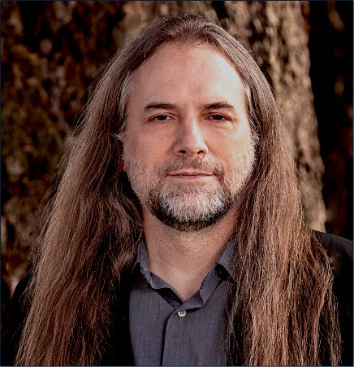
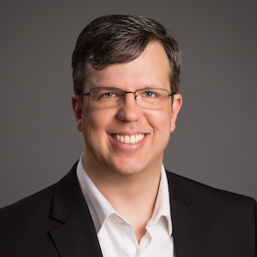

#### [Introduction](#Intro) | [Topics](#topics) | [Dates](#dates) | [Organizers](#org) | [Program Committee](#pc) | [Submission](#submission) | [Program](#program) 
----

#### held in conjunction with [SC'25](https://sc25.supercomputing.org/) and in cooperation with [IEEE Computer Society](https://www.computer.org)
#### 2:00PM - 5:30PM, Sunday, November 16, 2025
#### Room 274, [the America’s Center Convention Complex](https://sc25.supercomputing.org/attend/convention-center/)
----
#### 2:00 - 3:05, MEMO'25 Opening: [Maya Gokhale](https://people.llnl.gov/gokhale2)
#### 2:05 - 3:00, Expert Panel: Energy-efficient Memory Technology for maximizing bandwidth and reducing latency
#### Overview:
Historically, the performance of many HPC applications has been limited by memory bandwidth and latency. Memory bandwidth has increased at an order of magnitude less per year (on average) versus processor performance. Improving memory latency has proven to be even more challenging. This panel brings together industry leaders involved in the NNSA’s Advanced Memory Technology program, which was conceived to address memory performance by inspiring dramatic memory technology advancements for NNSA applications. The panel will discuss future memory technologies, including trends, challenges, and efforts to rethink and overcome memory system performance hurdles.
#### Moderator: 
+ Gwendolyn Voskuilen (Sandia National Laboratories)

#### Panelists:
Josh Fryman (Intel)&nbsp;&nbsp;&nbsp;&nbsp;&nbsp;&nbsp;&nbsp;&nbsp;Nuwan Jayasena (AMD)&nbsp;&nbsp;&nbsp;&nbsp;&nbsp;&nbsp;&nbsp;&nbsp;Mike O'Connor (NVIDIA)&nbsp;&nbsp;&nbsp;&nbsp;&nbsp;Leighton Wilson (Cerebras)

&nbsp;&nbsp;&nbsp;&nbsp;&nbsp;&nbsp;&nbsp;&nbsp;&nbsp;&nbsp;&nbsp;&nbsp;&nbsp;&nbsp;&nbsp;&nbsp;&nbsp;&nbsp;&nbsp;&nbsp;&nbsp;&nbsp;&nbsp;&nbsp;&nbsp;&nbsp;&nbsp;&nbsp;&nbsp;&nbsp;   
   
   
   
**Josh Fryman** is an Intel Fellow and CTO for the Intel Government Technologies group, while also directing the R&D strategy for the public sector. Josh is primarily focused on applied R&D for commercial and government customers for problems that are 3-10 years out on the horizon.  Josh has personally been engaged in everything from microprocessor design to system architectures, compilers, runtimes, applications, and algorithms.  Josh was chief architect or PI for multiple R&D programs spanning multiple government agencies and technical domains. Josh obtained his BS in Computer Engineering from Univ. of Florida, and his PhD in Computer Architecture from GaTech.

**Nuwan Jayasena** is a Fellow at AMD Research and Advanced Development with 20+ years’ experience in processor and system design. He leads a team focused on future memory and accelerator architectures. Nuwan holds an M.S and a Ph.D. in Electrical Engineering from Stanford University, is an inventor of over 90 granted US patents, and is an author of over 30 peer-reviewed publications. Prior to AMD, Nuwan was a processor architect at Stream Processors, Inc. and at Nvidia.

**Mike O'Connor** is a Principal Research Scientist in the Architecture Research Group at NVIDIA, where he develops future DRAM and memory system architectures.  In a prior role at NVIDIA, he was the memory system architecture lead for several generations of NVIDIA GPUs. Mike’s career has also included positions at AMD, Texas Instruments, Silicon Access Networks (a network-processor startup), Sun Microsystems, and IBM.  At AMD, he drove key aspects of the architecture definition for the initial High-Bandwidth Memory (HBM) specification.   Mike has a BSEE from Rice University and an MSEE & PhD from the University of Texas at Austin.

**Leighton Wilson** is a Senior Member of Technical Staff at Cerebras Systems. He works with customers across industry and government to achieve record-shattering performance on Cerebras’s wafer-scale architecture. He also leads development efforts for the Cerebras SDK for low-level system programming and manages software development for a Cerebras collaboration with the Defense Advanced Research Projects Agency (DARPA). In 2023, he was a Gordon Bell Award finalist for his work with Cerebras and KAUST on scaling the “Memory Wall” for multi-dimensional seismic processing with algebraic compression on Cerebras CS-2 systems. In 2021, Leighton received his PhD in Applied and Interdisciplinary Mathematics and Scientific Computing at the University of Michigan, working with Robert Krasny on fast summation methods for biomolecular electrostatics.

---
#### SC Coffee Break (3:00 - 3:30)
---
#### Technical Paper Presentations (Moderator: [Kyle C. Hale](https://engineering.oregonstate.edu/people/kyle-c-hale))
+ 3:30 - 3:50pm: Umpire: Portable Memory Management for High-Performance Computing Applications
  + Kristi Belcher, David Beckingsale
+ 3:50 - 4:10pm:The MALL is Open: Exploring Shared Caches and Latency in AMD CDNA™ 3 GPUs
  + Andrew Tee, Nicholas Curtis, Noah Wolfe, Daniel Wong
+ 4:10 - 4:30pm:CaRDS: Compiler-aided Remote Data Structures
  + Brian Tauro, Ian Dougherty, Kyle Hale
+ 4:30 - 4:50pm:Hardware-Software Co-Design of Iterative Filter-Update Numerical Methods Using Processing-In-Memory
  + Eric Tang, Tianyun Zhang, William Bradford, Farzana Siddique, James Hoe, Kevin Skadron, Franz Franchetti

---
#### CXL focus session (4:50 - 5:30) (Moderator: [Stephen Lecler Olivier](https://www.sandia.gov/ccr/staff/stephen-lecler-olivier/))
##### Talk 1: AMAIS — Advanced Memory to Support AI for Science
+ Speaker: [Andres Marquez (Pacific Northwest National Laboratory)](https://www.pnnl.gov/people/andres-marquez)
  + Bio: Dr. Marquez is a Chief Scientist at Pacific Northwest National Laboratory (PNNL) and a Team Lead for the Future Computing Technologies Group, focusing on Next Gen Architecture Design. He's the manager of PNNL's Advanced Measurement Laboratory and Principal Investigator for the Advanced Memory to Support AI for Science (AMAIS) project, exploring novel system-level memory technologies.
  + Abstract: Multiple technological and economic inflection points are converging to challenge the trajectory of continuous computing growth observed over the past 30 years. Jim Gray's visionary Fourth Paradigm of Data-Intensive Scientific Discovery is now fully manifest in the form of AI-accelerated computing, reshaping the landscape of scientific exploration and computational workloads.
In response to these challenges, the AMAIS (Advanced Memory to support AI for Science) project introduces a heterogeneous, active memory compute paradigm designed to handle and accelerate data-intensive workloads on large memory systems. 
This talk will briefly showcase the machines being deployed. 

##### Talk 2: CXL Shared Memory Case Study: Building a Shared Tier for Lustre Metadata 
+ Speaker: [Jie Ren (William & Mary)](https://www.wm.edu/as/computerscience/people/ren_jie.php)
  + Bio: Dr. Jie Ren is an Assistant Professor of Computer Science at William & Mary. Her research interests include High-Performance Computing, parallel and distributed systems, heterogeneous and composable memory systems, and affordable machine learning systems. Her work aims to improve the accessibility, efficiency, and scalability of modern computing infrastructures.
  + Abstract: Lustre’s metadata path remains a bottleneck: namespace scans inflate tail latency, hot directories serialize, and Distributed Namespace coordination adds extra rounds of work. Compute Express Link (CXL) offers a pooled, byte-addressable memory tier that multiple metadata servers can access via load/store at cache-line granularity. This talk explores a CXL-based shared metadata tier for Lustre that keeps high-leverage metadata warm across servers to shorten lookups, smooth scan tails, and speed restarts, addressing both the I/O wall and the coordination wall while sharing lessons from our early prototype. 

---
#### Closing Remarks (5:30): Maya Gokhale
----

### Introduction
Recent developments of new memory technologies, such as high-bandwidth memory, non-volatile memory, and disaggregated memory, coupled with advanced high-performance interconnects like CXL and NVlink-c2c, further expand the memory hierarchy and increasingly blur the boundary between memory and storage. The growing disparity between computing speed and memory speed, commonly referred to as the Memory Wall problem, remains a critical and enduring challenge in the computing community. 

The prevalence of heterogeneous computing, ongoing advancements in the memory hierarchy, and the rise of disaggregated architectures significantly broaden the scope of the challenge of efficiently exploiting memory subsystems on large-scale parallel systems. Simultaneously, the proliferation of large machine learning models, graph processing, quantum computer simulations, and traditional scientific applications facing bottlenecks due to memory latency, bandwidth, and capacity constraints, continue to drive researchers, professionals, and practitioners to enhance memory system design and memory management. Computer architecture, operating systems, storage systems, middleware, performance models, tools, and applications are continuously being optimized or even redesigned to address the performance, programmability, and energy efficiency challenges of Memory Wall. Exploring the intersection of these research areas will enable cohesive and synergistic development and collaboration on the future of memory technologies, systems, middleware, and applications. 

This workshop aims to bring together computer science and computational science researchers, from industry, government labs, and academia, concerned with the challenges of efficiently using existing and emerging memory systems. The term performance for memory systems is general, which includes latency, bandwidth, power consumption, and reliability from the aspect of hardware memory technologies to how it is manifested in the application performance.

### Topics of Interest 
The topics of interest include, but are not limited to:

+ Evaluation, characterization, performance analysis, and use cases of emerging memory technologies, including non-volatile memories, high-bandwidth memory, heterogeneous memory, disaggregated memory, etc.

+ Software, hardware, and co-design approaches that ease the adoption and optimize the use of processing-in-memory and near-memory computing technologies.

+ Programming interfaces or language extensions that improve the programmability of using emerging memory technologies and systems, heterogeneous memory system and multi-dimensional data, and unified memory systems.

+ Compiler, runtime, and system techniques for optimizing data layout and placement, page migration, coherence and consistency enforcement, latency hiding and improving bandwidth utilization and energy consumption of heterogeneous memory systems.

+ Enhancement or new development for operating systems, storage and file systems, and I/O system that address challenges of existing and emerging memory technologies, heterogeneous memory systems, and the blurred boundary between memory and storage.

+ Tools, modeling, evaluation, and case study of memory system behavior and application performance that reveals the limitations and characteristics of existing memory systems.

+ Application development and optimization for new memory architecture and technologies and those overcome memory related challenges in their problems.

----
### Important Dates
 + Submission Deadline -- ~~July 27~~ August 10, 2025 (AoE) -- [Submission is Open](https://submissions.supercomputing.org). 
 + Notifications -- September 01, 2025 (AoE)
 + Camera Ready Papers -- September 29, 2025 (FIRM)
 + Workshop -- November 16 (Sunday afternoon), 2025

---

### Submission and Review Process
[Submission is Open](https://submissions.supercomputing.org). Login to SC'25 [Submission Site](https://submissions.supercomputing.org), click 'Make a New Submission', choose **MEMO'25**. For SC25, ACM is the SC proceeding publisher. Submissions must use the template at https://www.acm.org/publications/proceedings-template (use \documentclass[sigconf,screen,final]{acmart} in the ACM LaTeX template). Submitted manuscripts may not exceed eight (8) pages in length for regular papers and at least (4) pages for short papers, excluding references.

Submitted papers must represent original unpublished research that is not currently under review for any other conference or journal. Each paper is expected to receive a minimum of 3 reviews. Double-blind peer-review will be used. Papers will be evaluated based on novelty, technical soundness, clarity of presentation, and impact.

Optionally, authors may submit Artifact Description (AD) or Artifact Evaluation (AE) appendices in the submitted manuscript (see https://sc25.supercomputing.org/program/papers/reproducibility-initiative/).
 
---

### Program Committee
+ Gwendolyn Voskuilen (Sandia National Laboratories, USA)
+ Frank Hady (Intel Fellow)
+ Kengo Nakajima (The University of Tokyo; RIKEN, Japan)
+ Seyong Lee (Oak Ridge National Laboratory, USA)
+ Edgar A Leon (Lawrence Livermore National Laboratory, USA)
+ Petar Radojkovic (Barcelona Supercomputing Center (BSC); Polytechnic University of Catalonia, Spain)
+ Jie Ren College of William & Mary, USA)
+ Ivy Peng (KTH Royal Institute of Technology, Sweden)
+ Maya Gokhale (Lawrence Livermore National Laboratory, USA)
+ Stephen L. Olivier (Sandia National Laboratories, USA)
+ Kyle Hale (Oregon State University, USA)

---
### Organizers
 + Maya Gokhale (Lawrence Livermore National Laboratory, USA)
 + Ivy Peng (KTH Royal Institute of Technology, Sweden)
 + Kyle Hale (Oregon State University, USA)
 + Stephen L. Olivier (Sandia National Laboratories, USA)
 + Ron Minnich (Hewlett Packard Enterprise, USA)

 

