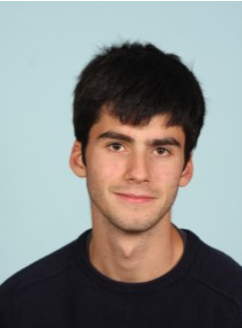

------

<section align="center">
 
<a href="https://ibpeng.github.io/">Ivy Peng, Ph.D</a> 
Assistant Professor 
Department of Computer Science 
EECS, KTH 
</section> 

I lead Scalable Parallel System Laboratory (ScaLab) in downtown Stockholm, Sweden. I was a Computer Scientist at Parallel System Group at Lawrence Livermore National Laboratory (LLNL), USA. My research revolves around large-scale parallel systems, including computer architecture, system software, and applications. I am interested in system-level optimizations for workload and architecture characteristics to improve the scalability and efficiency of future computing systems.

My current research topics are:
Heterogeneous computing (e.g., accelerators like GPU and DPU, and hybrid memories).
Memory-centric computing (e.g., disaggregated memory and persistent memory).
Converged HPC and cloud computing (e.g., adaptive resource scaling, malleability).

**Recent Professional Services**:  
IEEE Transactions on Parallel and Distributed Systems (TPDS). Editorial Review Board. 
The International Conference for High Performance Computing, Networking, Storage, and Analysis (SC’23). Proceeding Chair. 
ACM SIGPLAN Symposium on Principles and Practice of Parallel Programming (PPoPP’23). Main PC. 
The International ACM Symposium on High-Performance Paralleland Distributed Computing (HPDC’21,HPDC’22). Workshop Chair. 

------

<section align="center">
 
<a href="https://www.kth.se/profile/jacobwah">Jacob Wahlgren</a> 
Doctoral Student 
Department of Computer Science 
EECS, KTH 
</section>

<section align="left">
<strong>Research Interests:</strong> 
Heterogeneous Computing, High-Performance Computing 
</section> 

<strong>About me:</strong> 
My current research revolves around next-generation memory systems in high-performance computing. Disaggregated memory promises to increase the efficiency of cloud data centers by using rack-scale memory pools. We aim to answer questions such as: How can we utilize memory disaggregation in supercomputing enviroments? How will memory disaggregation impact the performance of scientific workloads such as computational physics? What new acceleration techniques are enabled by disaggregated systems?

------

<section align="center">
 
<a href="https://www.kth.se/profile/dadm/">Daniel Araújo de Medeiros</a> 
Doctoral Student 
Department of Computer Science 
EECS, KTH 
</section>

<section align="left">
<strong>Research Interests:</strong> 
Parallel I/O, Converged Cloud and HPC Computing 
</section> 

<strong>About me:</strong> 
I'm Daniel, a doctoral student at KTH. My field of study is High Performance Computing and, as implied, I deal with a lot of problems in relation to parallel and distributed systems.
I research on technologies that are used in warehouse-scale computers ("datacenters") and could be used in traditional supercomputers on academic settings. Such technologies ranges from the usage of kubernetes and containers to object storage systems. Furthemore, I have strong interests in non-traditional computer architectures and stuff like binary translation/emulation.

------

<section align="center">
 
<a href="https://www.kth.se/profile/gabins">Gabin Schieffer</a> 
Doctoral Student 
Department of Computer Science 
EECS, KTH 
</section>

<section align="left">
<strong>Research Interests:</strong> 
Heterogeneous Computing, Parallel Algorithms, GPU 
</section> 

<strong>About me:</strong> 
Bonjour! My name is Gabin Schieffer, I am a doctoral student in Computer Science at KTH. I am part of the Scalable Parallel System Laboratory research group (ScaLab). My research focus on GPU acceleration of scientific applications.  I am also interested in distributed computing, in both HPC clusters and cloud computing environments. My current work aims at enabling the use of novel GPU features to accelerate typical high-performance computing workloads, such as molecular docking applications.

------

<section align="center">
 
<a href="https://www.kth.se/profile/faj">Jennifer Faj</a> 
Doctoral Student 
Department of Computer Science 
EECS, KTH 
</section>

<section align="left">
<strong>Research Interests:</strong> 
Heterogeneous Computing, Parallel Algorithms, FPGA 
</section> 

<strong>About me:</strong> 

------

<section align="center">
 
<a href="">Jakob Arvidsson</a> 
MS Student 
Department of Computer Science 
EECS, KTH 
</section>

<section align="left">
<strong>Research Interests:</strong> 
DNA computing 
</section> 

<strong>About me:</strong> 

------

<section align="center">
 
<a href="">Federico Ruilova</a> 
MS Student 
ICT Innovation – Cloud and Network Infrastructures 
EECS, KTH 
</section>

<section align="left">
<strong>Research Interests:</strong> 
Carbon-aware technologies for high-performance computing in distributed environments 
</section> 

<strong>About me:</strong> 

------

<section align="center">
 
<a href="">Philip Salqvist</a> 
MS Student 
Department of Computer Science 
EECS, KTH 
</section>

<section align="left">
<strong>Research Interests:</strong> 
Data Lakehouses, Data Warehouses 
</section> 

<strong>About me:</strong> 

------

<section align="center">
 
<a href="">Kevin Arnmark</a> 
MS Student 
Department of Computer Science 
EECS, KTH 
</section>

<section align="left">
<strong>Research Interests:</strong> 
CUDA Graph 
</section> 

<strong>About me:</strong> 

------
