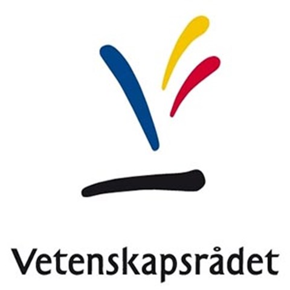
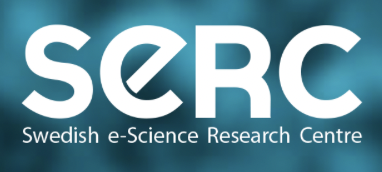

Our research is supported by European Commision, Swedish Research Council, Swedish e-Science Research Centre

     

#### Open-Source Cloud-Based Services on EPI Systems

heterogenous architecture and middleware for efficient converged HPC and cloud computing

#### Application-centric heterogeneity-aware data movement optimizations

tackling data movement challenges on emerging heterogeneous systems with specialized accelerators

#### A System-informed Approach for Disaggregated Memory Systems

developing quantitative approaches for leveraging CXL-like disaggregated memory systems

* * *

